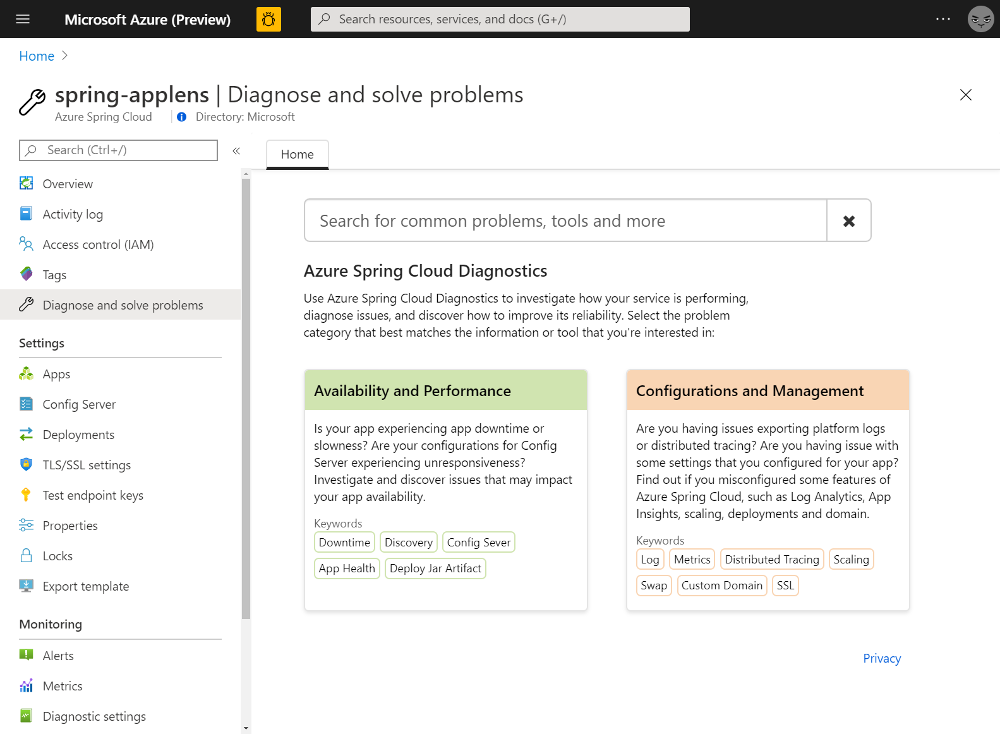
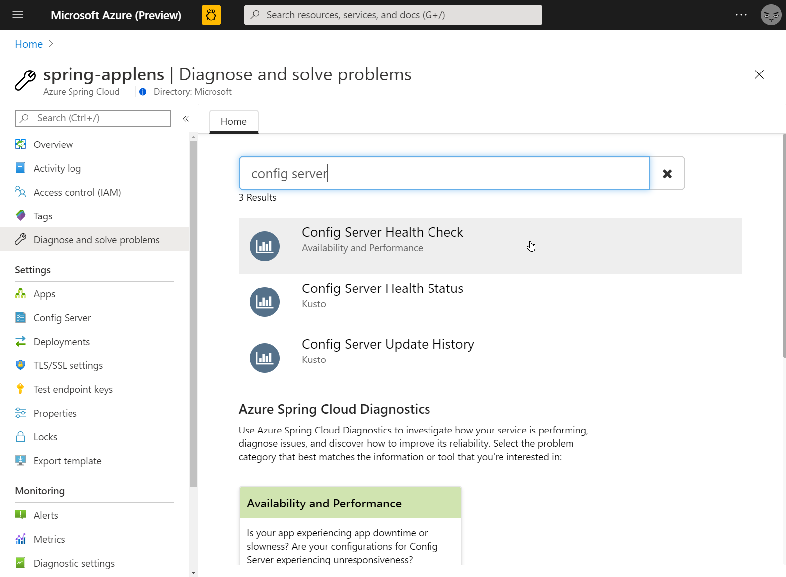
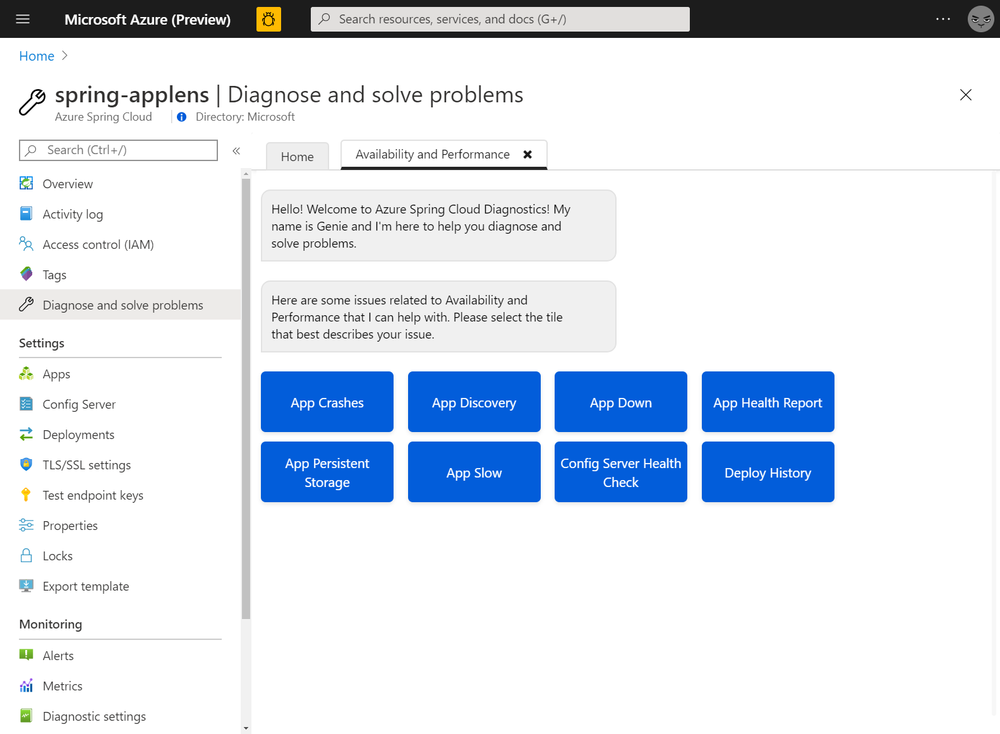
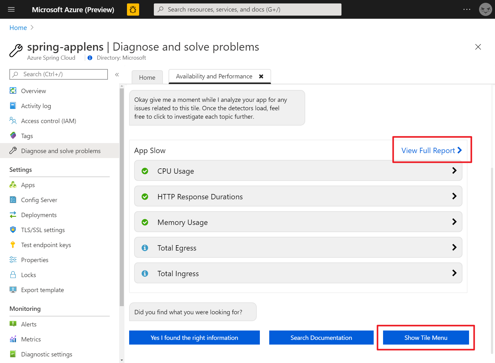
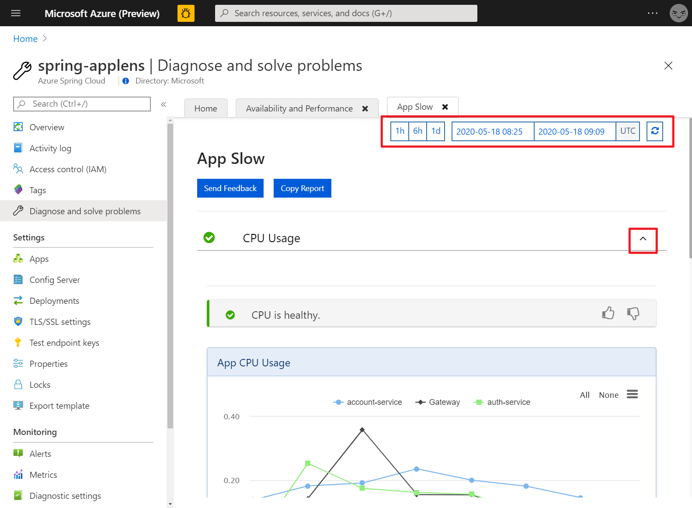
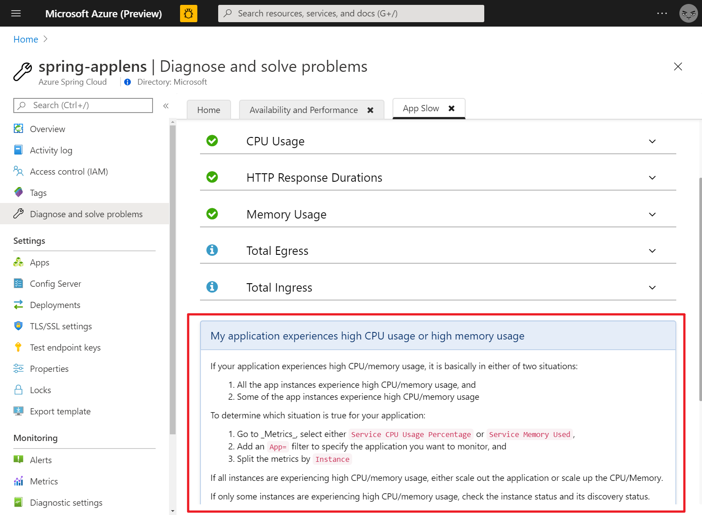

# Self Diagnose and Solve Problems for Azure Spring Cloud

This tutorial shows you how to self diagnose and solve problems for Azure Spring Cloud with AppLens detectors. AppLens detectors provide an easy way to collect metrics and logs to enable you fast diagnose and solve problems.

## Prerequisites

To complete this tutorial, you need:

* An Azure subscription. If you don't have an Azure subscription, create a [free account](https://azure.microsoft.com/free/?WT.mc_id=A261C142F) before you begin.

* A deployed Azure Spring Cloud service instance. Follow our [quickstart on deploying an app via the Azure CLI](https://docs.microsoft.com/en-us/azure/spring-cloud/spring-cloud-quickstart-launch-app-cli) to get started.

* At least one application already created in your service instance.

## Navigate to the Diagnose and solve problems page in Azure portal

1. Sign in to the [Azure portal](https://portal.azure.com/).

1. Go to your Azure Spring Cloud **Overview** page.

1. Open **Diagnose and solve problems** in the menu on the left side of the page.

## Search and execute detectors

To find a detector, you can either search detectors by typing a keyword or click solution group to explore all detectors.

When you find your target detector, click it to execute. A summary of diagnostic will be shown after you execute the detector. You can select **View Full Report** to check diagnostic details or click **Show Tile Menu** button to go back to detector list.

In diagnostic details page, you can change the diagnostic time range with the controller at right top corner. To see more metrics or logs, toggle each diagnostic.

Some detectors also contain a related documentation to guide you the next step.

